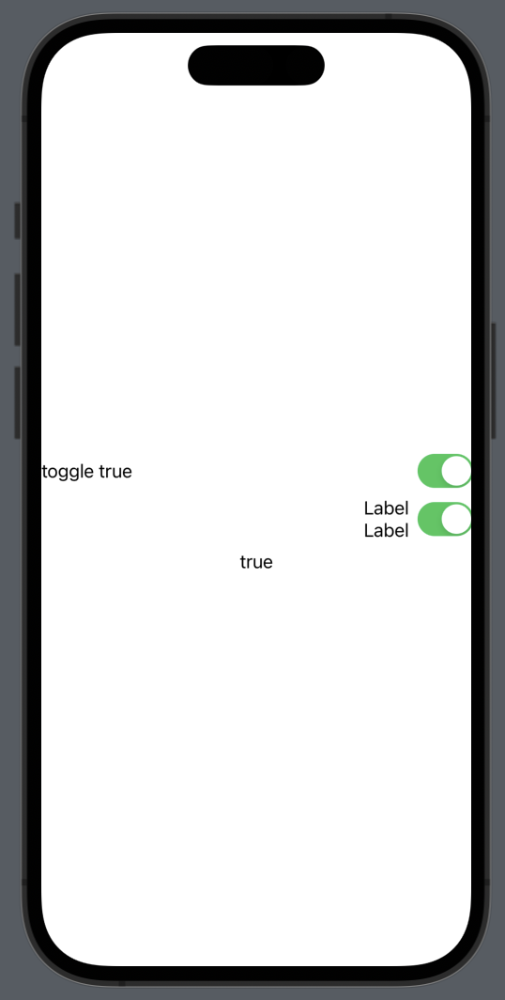
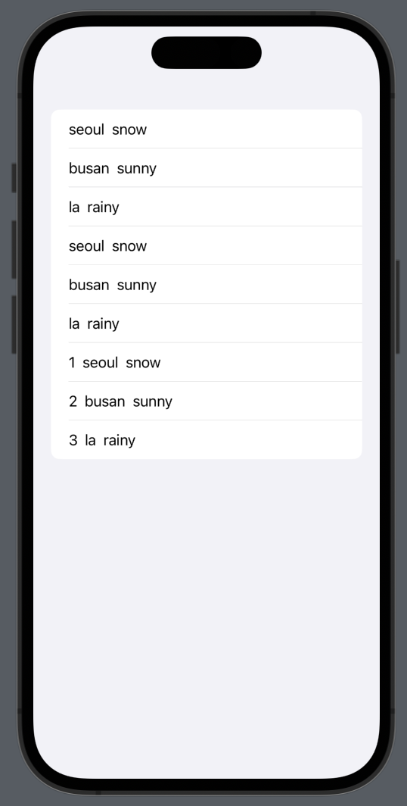
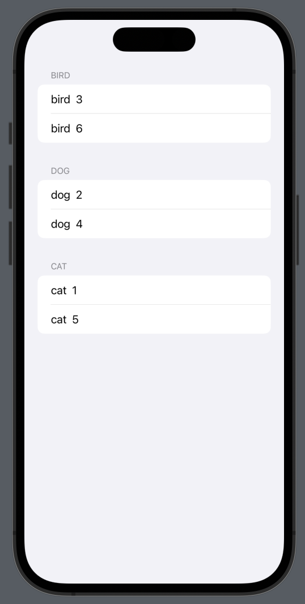
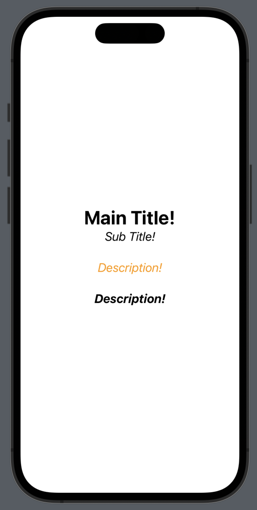
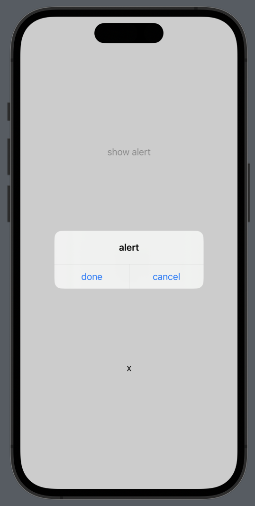

# Toggle

```swift
import SwiftUI

struct ContentView: View {
    
    @State private var isOn = false
    
    var body: some View {
        Toggle("toggle \(isOn.description)", isOn: $isOn)
        //$ : 원래 값에 바인딩
        //토글에서 변경 -> 원래 값이 변경
    }
}
```

- 바인딩을 사용하는 이유
    - 변경하는 값이랑 변경돼서 보여져야하는 UI랑 바로 매칭되어야 함 (원래 값이랑 연결)

```swift
import SwiftUI

struct ContentView: View {
    
    @State private var isOn = false
    
    var body: some View {
        VStack{
            MyToggle(isOn: $isOn)
            Text("\(isOn.description)")
        }
    }
}

struct MyToggle: View {
    
    @Binding var isOn: Bool
    //Binding은 원본 값이 어딘가에 있기 때문에 값 선언 불가
    
    var body: some View{
        Toggle("toggle \(isOn.description)", isOn: $isOn)
        Toggle(isOn: $isOn, label: {
            HStack{
                Spacer() //오른쪽으로 밀기 위함
                VStack{
                    Text("Label")
                    Text("Label")
                }
            }
        })
    }
}
```


# List ForEach

```swift
import SwiftUI

//Model
struct LocationInfo: Hashable, Identifiable {
    var id = UUID() //id 자동생성
    var city = ""
    var weather = ""
}
//ForEach의 id를 self로 하려면 Hashable 프로토콜 준수
//id없는 ForEach 사용 -> Identifiable 프로토콜 준수
//UUID() : 고유한 난수 값 생성

struct ContentView: View {
    
    @State private var locations = [
        LocationInfo(city: "seoul", weather: "snow"),
        LocationInfo(city: "busan", weather: "sunny"),
        LocationInfo(city: "la", weather: "rainy")
    ]
    
    var body: some View {
        List{
            //Hashable 프로토콜 준수
            ForEach(locations, id: \.self){
                location in
                HStack{
                    Text("\(location.city)")
                    Text("\(location.weather)")
                }
            }
            //Identifiable 프로토콜 준수
            ForEach(locations) { location in
                HStack{
                    Text("\(location.city)")
                    Text("\(location.weather)")
                }
            }
            //인덱스 접근 가능한 ForEach(data: Range<Int>, content)
            ForEach(0..<locations.count) { index in
                HStack{
                    Text("\((index+1))")
                    Text("\(locations[index].city)")
                    Text("\(locations[index].weather)")
                }
            }
        }
    }
}
```



# List Section

> Section: row의 묶음
> 

```swift
import SwiftUI

//Section: row의 묶음

//model
struct Animal: Identifiable {
    let id = UUID()
    let name: String
    let index: Int
}

struct ContentView: View {
    
    var animalList = [
        Animal(name: "dog", index: 4),
        Animal(name: "bird", index: 3),
        Animal(name: "dog", index: 2),
        Animal(name: "cat", index: 1),
        Animal(name: "cat", index: 5),
        Animal(name: "bird", index: 6)
    ]
    
    //그룹화
    //dog : [Animal, Animal, Animal]
    var animalGrouped: [String : [Animal]] {
        var groupData = Dictionary(grouping: animalList) { $0.name }
        
        for (key, value) in groupData {
            groupData[key] = value.sorted(by: {$0.index < $1.index})
        }
        
        return groupData
    }
    
    var groupKey: [String] {
        animalGrouped.map { $0.key }
    }
    
    var body: some View {
        List{
            ForEach(groupKey, id: \.self) { animalKey in
                Section(header: Text("\(animalKey)")) {
                    //row 표현
                    ForEach(animalGrouped[animalKey]!) { animal in HStack{
                            Text("\(animal.name)")
                            Text("\(animal.index)")
                        }
                    }
                }
            }
        }
    }
}
```



# ViewModifier

```swift
import SwiftUI

struct ContentView: View {
    
    var body: some View {
        VStack{
            Text("Main Title!")
                .font(.largeTitle)
                .foregroundColor(.black)
                .bold()
            Text("Sub Title!")
                .modifier(MyTextStyle())
            Text("Description!")
                .modifier(MyTextStyle(myColor: .orange))
            Text("Description!")
                .modifier(MyTextStyle(myWeight: .bold))
        }
    }
}

struct MyTextStyle: ViewModifier {
    var myWeight = Font.Weight.regular
    var myFont = Font.title2
    var myColor = Color.black
    
    func body(content: Content) -> some View {
        content
            .font(myFont.weight(myWeight))
            .foregroundColor(myColor)
            .italic()
            .padding(.bottom, 20)
    }
}
```



# Alert View

```swift
import SwiftUI

struct ContentView: View {
    
    @State private var isShowAlert = false
    
    @State private var selectText = "x"
    
    var body: some View {
        VStack{
            Spacer()
            Button("show alert"){
                isShowAlert.toggle()
            }
            .alert(isPresented: $isShowAlert) {
//                Alert(title: Text("alert"), dismissButton: .cancel())
                let primaryButton = Alert.Button.default(Text("done")) {
                    selectText = "done"
                }
                let secondaryButton = Alert.Button.default(Text("cancel")) {
                    selectText = "cancel"
                }
                return Alert(title: Text("alert"), primaryButton: primaryButton, secondaryButton: secondaryButton)
            }
            Spacer()
            Text("\(isShowAlert.description)")
            Spacer()
            Text("\(selectText)")
            Spacer()
        }
    }
}
```



# WebView Basic

> WebView.swift
> 

```swift
import Foundation
import WebKit
import SwiftUI

struct WebView: UIViewRepresentable {
    
    var url: String
    
    func makeUIView(context: Context) -> some UIView {
        let url = URL(string: self.url)
        let request = URLRequest(url: url!)
        
        let wkWebView = WKWebView()
        wkWebView.load(request)
        
        return wkWebView
    }
    
    func updateUIView(_ uiView: UIViewType, context: Context) {
        
    }
}
```

> ContentView.swift
> 

```swift
import SwiftUI

struct ContentView: View {
    
    var body: some View {
        WebView(url: "https://apple.com")
    }
}
```

