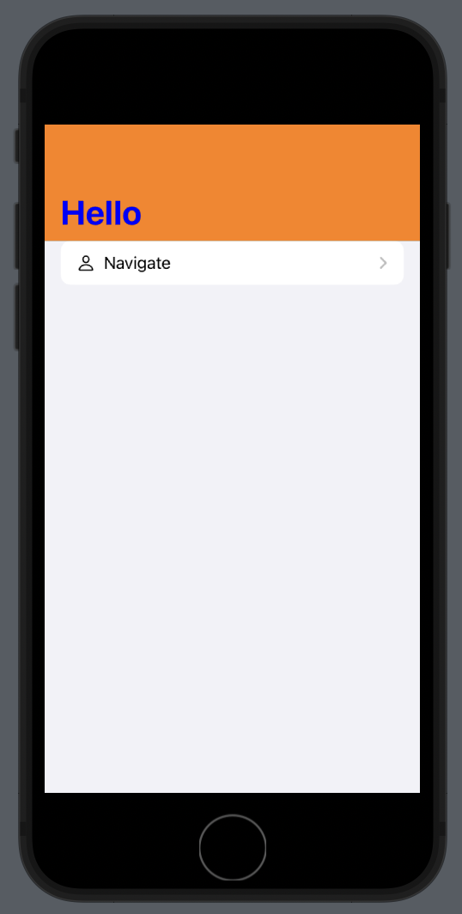
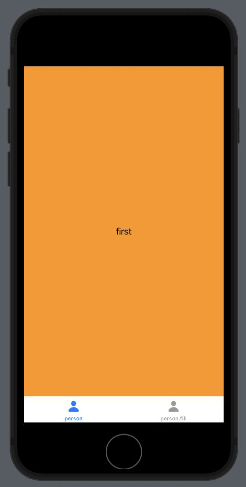

# Grid

```swift
import SwiftUI

struct ContentView: View {
    
    var columns: [GridItem] {
        [
						// 크기 고정
            GridItem(.fixed(200)),
            // 커질 수 있는 크기만큼 최대로 커짐
            GridItem(.flexible(minimum: 50, maximum: 200)),
            GridItem(.flexible(minimum: 50, maximum: 200)),
            GridItem(.flexible(minimum: 50, maximum: 200))
            // minimum으로 잡을 수 있는 상황일 때는 minimum으로 표현
            GridItem(.adaptive(minimum: 50, maximum: 100))
        ]
    }
    
    var body: some View {
        //대체로 scrollview를 감싸서 표현
        ScrollView(.vertical){
            LazyVGrid(columns: columns) {
                        Image(systemName: "music.mic")
                            .resizable()
                            .aspectRatio(contentMode: .fit)
                        Image(systemName: "music.mic")
                            .resizable()
                            .aspectRatio(contentMode: .fit)
                        Image(systemName: "music.mic")
                            .resizable()
                            .aspectRatio(contentMode: .fit)
                        Image(systemName: "music.mic")
                            .resizable()
                            .aspectRatio(contentMode: .fit)
                        Image(systemName: "music.mic")
                            .resizable()
                            .aspectRatio(contentMode: .fit)
                    }
        }
        
    }
}
```


# Placeholder

```swift
import SwiftUI

// Placeholder -> redact기능 안에 들어있음

struct ContentView: View {
    
    @State private var myString = "hello world"
    
    @State private var showPlaceholder = false
    
    var body: some View {
        VStack{
            VStack{
                Image(systemName: "person")
                    .resizable()
                    .frame(width: 100, height: 100)
                    .clipShape(Circle()) //도형만큼 자르기
                    .overlay(Circle().stroke()) //채우기
                Text(myString)
                    .foregroundColor(.red)
                    .padding()
            }
            .redacted(reason: showPlaceholder ? .placeholder : .init())
            Button("click me") {
                showPlaceholder.toggle()
            }

        }
    }
}
```


# NavigationView

```swift
import SwiftUI

struct ContentView: View {
    
    //UIKit 사용해서 navigationbartitle 커스텀
    init(){
        let myAppearance = UINavigationBarAppearance()
        //.inline
        myAppearance.titleTextAttributes = [
            .foregroundColor : UIColor.red,
            .font : UIFont.italicSystemFont(ofSize: 30)
        ]
        //.large
        myAppearance.largeTitleTextAttributes = [
            .foregroundColor : UIColor.blue,
        ]
        
        myAppearance.backgroundColor = .orange
        
        //적용
        //.inline
        UINavigationBar.appearance()
            .standardAppearance = myAppearance
        //.large
        UINavigationBar.appearance()
            .scrollEdgeAppearance = myAppearance
        //네이게이션 뷰 표현하는 부분이 bartitle보다 작아질 때
        UINavigationBar.appearance()
            .compactAppearance = myAppearance
    }
    
    var body: some View {
        NavigationView {
            
            List{
                NavigationLink(destination: Text("Destination"), label: {
                    HStack{
                        Image(systemName: "person")
                        Text("Navigate")
                    }
                })
            }
            .navigationBarTitle("Hello", displayMode: .large)
        }
    }
}
```



# TabView

```swift
import SwiftUI

struct ContentView: View {
    
    var body: some View {
        TabView{
            First()
                .tabItem {
                    Image(systemName: "person")
                    Text("person")
                }
                .edgesIgnoringSafeArea(.top)
            Second()
                .tabItem {
                    Image(systemName: "person.fill")
                    Text("person.fill")
                }
        }
    }
}

struct First: View{
    var body: some View{
        ZStack{
            Color.orange
            Text("first")
        }
    }
}

struct Second: View{
    var body: some View{
        ZStack{
            Color.yellow
            Text("second")
        }
    }
}
```



# Toogle Custom

```swift
import SwiftUI

struct CustomToggle: ToggleStyle{
    //configuration 토글 환경에 대한 값을 바로 가져올 수 있음
    func makeBody(configuration: Configuration) -> some View {
        RoundedRectangle(cornerRadius: 100)
            .foregroundColor(configuration.isOn ? .red : .blue) //채우기
            .overlay(//얹이기
                //현재 뷰(위치)에서 크기, 좌표 가져오기 가능
                GeometryReader(content: { geometry in
                
                    ZStack{
                        Circle().foregroundColor(.white)
                            .frame(width: geometry.size.height)
                        Text(configuration.isOn ? "on" : "off")
                            
                    }
                    .offset(x: configuration.isOn ? geometry.frame(in: .local).minX : geometry.frame(in: .local).maxX - geometry.size.height
                    )
                    .animation(.easeInOut(duration: 0.3))
                    .shadow(radius: 10)
                    
                })
                
            )
            .clipShape(Capsule()) //토글 바깥쪽으로 넘어감 방지
        
            .onTapGesture { //눌렀을 때 실행
                configuration.isOn.toggle()
            }
    }
}

struct ContentView: View {
    
    @State private var isOn = false
    
    var body: some View {
        Toggle("", isOn: $isOn)
            .toggleStyle(CustomToggle())
            .frame(width: 200, height: 50)
    }
}
```


