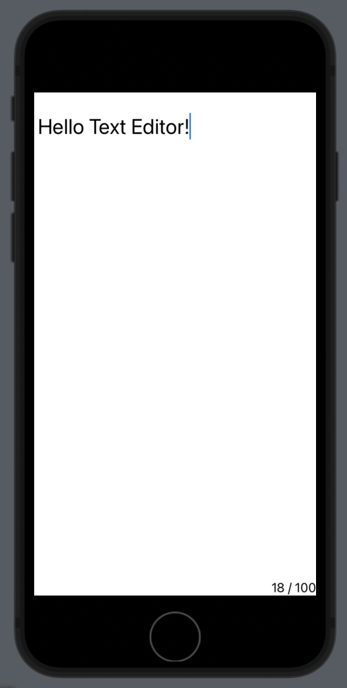

# TextEditor

```swift
import SwiftUI

struct ContentView: View {
    
    @State private var inputText = ""
    
    var body: some View {
        VStack{
            TextEditor(text: $inputText)
                .lineSpacing(40) //줄간격
                .font(.title)
                .disableAutocorrection(true) //자동완성
                .onChange(of: inputText) { newValue in
                    if inputText.count > 100 {
                        inputText.removeLast()
                    }
                } //값 계속 확인 가능
            HStack{
                Spacer()
                Text("\(inputText.count)" + " / 100")
            }
        }
        
    }
}
```


# ScrollViewReader

```swift
import SwiftUI

struct ContentView: View {
    
    @State private var proxy: ScrollViewProxy?
    
    var body: some View {
        VStack{
            Button("Scroll To") {
                withAnimation(.easeInOut) {
                    proxy?.scrollTo(20, anchor: .top) //스크롤 이동
                        //anchor: .top : 값을 맨 위로
                }//애니메이션 적용
            }
            ScrollView{//화면을 계속 그리는 부분
                ScrollViewReader { proxy in
                    
                    ForEach(0..<50){index in
                        Text("\(index)")
                            .id(index) //id 명시 필요
                            .padding()
                    }
                    .onAppear(perform: {
                        self.proxy = proxy
                    })//한 번만 호출
                }
            }
        }
        
    }
}
```


# State
- struct는 struct 안에서 선언된 변수 변경 불가능
    - 값을 변경 가능하게 해줌 → State
    - 바인딩 가능

# Binding

```swift
import SwiftUI

struct ContentView: View {
    
    @State private var myBool = false
    
    var body: some View {
            DetailView(mainToggleValue: $myBool)
    }
}

struct DetailView: View{
    
    @Binding var mainToggleValue: Bool
    
    var body: some View {
        Toggle("detail toggle", isOn: $mainToggleValue)
    }
}
```

# ObservableObject

- 복잡한 모델을 사용할 경우

```swift
import SwiftUI

//ObservableObject 프로토콜 준수
class MyInfo: ObservableObject {
    @Published var myAge = 20 //항상
    var myName = "lin" {//조건을 넣을 경우
        didSet{
            if oldValue.count == 0 {
                objectWillChange.send()
                //화면을 만드는 부분에 값이 바뀌었다고 알림
            }
        }
    }
} //@Published 키워드 추가 -> 계속 관찰 -> 변경 후 즉시 갱신 (화면 갱신)

struct ContentView: View {
    //관측하는 형태로 가져옴
    @ObservedObject var myInfo = MyInfo()
    
    var body: some View {
        VStack{
            Text(myInfo.myName)
                .padding()
            
            Button("change name") {
                myInfo.myName = "leee"
            }
        }
    }
}
```

# EnvironmentObject

- singleton 개념
- 변수에 저장된 값을 여러 view 에서 써야할 때

```swift
import SwiftUI

class MyInfo: ObservableObject {
    @Published var myName = ""
    @Published var photoURL = ""
    var token = ""
}

struct ContentView: View {
    
    @EnvironmentObject var myInfo: MyInfo //type만 지정가능
    
    var body: some View {
        
        NavigationView {
            VStack{
                NavigationLink {
                    DetailView()
                } label: {
                    Text("navigate")
                }
                Text("name: \(myInfo.myName)")
                    .padding()
                Text("url: \(myInfo.photoURL)")
                    .padding()
            }
        }.onAppear {
            myInfo.myName = "kim"
            myInfo.photoURL = "https://aaa.com"
        }
    }
}

struct DetailView: View {
    
    @EnvironmentObject var myInfo: MyInfo
    
    var body: some View {
        VStack{
            Text("detail name: \(myInfo.myName)")
                .padding()
            Text("detail url: \(myInfo.photoURL)")
                .padding()
            Button("change name") {
                myInfo.myName = "lee"
            }
        }
    }
}

struct ContentView_Previews: PreviewProvider {
    static var previews: some View {
        ContentView()
            .environmentObject(MyInfo())
        //인스턴스화 시켜야지 메모리에 올라가서 실행됨
    }
}
```


# StateObject

```swift
import SwiftUI

class MyInfo: ObservableObject {
    @Published var myScore = 0
}

struct ContentView: View {
    
    @ObservedObject var myInfo = MyInfo()
    
    var body: some View {
        VStack{
            Text("\(myInfo.myScore)")
                .font(.largeTitle)
                .padding()
            Button("Plus1"){
                myInfo.myScore += 1
            }
            MyButton()
        }
    }
}

struct MyButton: View {
    
    @StateObject var myInfo2 = MyInfo()
    //뷰가 갱신돼도 값 유지
    //ObservedObject: 뷰가 갱신되면 값 변경
    
    var body: some View {
        VStack{
            Text("\(myInfo2.myScore)")
                .font(.largeTitle)
                .padding()
            Button("Plus2"){
                myInfo2.myScore += 1
            }
        }
    }
}
```


# ApppStoreage
- 간단한 값을 저장할 때 주로 사용

```swift
import SwiftUI

struct ContentView: View {
    
    @AppStorage("mode") var mode = false
    //keyword 설정 가능
    //앱에 저장돼서 앱을 다시 실행시켜도 계속 갖고 있는 값
    
    var body: some View {
        ZStack{
            mode ? Color.orange.opacity(0.5) : Color.gray
            Button {
                mode.toggle()
            } label: {
                Text("Button")
            }

        }
    }
}
```

# Grid View Gallery

- 그리드 형태별로 이미지를 보여주는 앱 만들기

> ContentView.swift
> 

```swift
import SwiftUI

enum GridType: CaseIterable {
    case single
    case double
    case triple
    case adaptive
    
    var columns: [GridItem] {
        switch self {
        case .single:
            return [GridItem(.flexible())]
        case .double:
            return [GridItem(.flexible()),
                    GridItem(.flexible()),]
        case .triple:
            return [GridItem(.flexible()),
                    GridItem(.flexible()),
                    GridItem(.flexible()),]
        case .adaptive:
            return [GridItem(.adaptive(minimum: 80))]
        }
    }
}

struct ContentView: View {
    
    var items = Item.dummyData
    
    @State private var selectedGridtype: GridType = .single
    
    var body: some View {
        VStack{
            GridTypePicker(gridType: $selectedGridtype)
            
            ItemStyle(items: items, gridType: $selectedGridtype)
        }
        
    }
}

struct ItemStyle: View {
    var items: [Item]
    @Binding var gridType: GridType
    
    var body: some View {
        ScrollView{
            LazyVGrid(columns: gridType.columns) {
                ForEach(items) { item in
                    switch gridType {
                    case .single:
                        SingleRow(item: item)
                    default:
                        Image(item.imageName)
                            .resizable()
                            .aspectRatio(contentMode: .fit)
                    }
                }
            }
            .animation(.default)
        }
    }
}

struct GridTypePicker: View {
    
    @Binding var gridType: GridType
    
    var body: some View {
        Picker("Grid Type", selection: $gridType) {
            ForEach(GridType.allCases, id: \.self) { type in
                switch type {
                case .single:
                    Image(systemName: "rectangle.grid.1x2")
                case .double:
                    Image(systemName: "square.grid.2x2")
                case .triple:
                    Image(systemName: "square.grid.3x2")
                case .adaptive:
                    Image(systemName: "square.grid.4x3.fill")
                }
            }
        }
        .pickerStyle(SegmentedPickerStyle())
    }
}

struct ContentView_Previews: PreviewProvider {
    static var previews: some View {
        ContentView()
    }
}
```

> Item.swift
> 

```swift
import Foundation

struct Item: Identifiable {
    let id = UUID()
    let mainTitle: String
    let subTitle: String
    let imageName: String
    
    static var dummyData: [Item] {
        
        (0...30).map {
            Item(mainTitle: "Main Title Index\($0)",
                 subTitle: "Sub Title Index\($0)",
                 imageName: "freeBG\($0 % 3 + 1)")
        }
    }
}
```

> SingleRow.swift
> 

```swift
import Foundation

struct Item: Identifiable {
    let id = UUID()
    let mainTitle: String
    let subTitle: String
    let imageName: String
    
    static var dummyData: [Item] {
        
        (0...30).map {
            Item(mainTitle: "Main Title Index\($0)",
                 subTitle: "Sub Title Index\($0)",
                 imageName: "freeBG\($0 % 3 + 1)")
        }
    }
}
```


# Network JSON

- JSON 데이터를 리스트 형식으로 표현

> ContentView.swift
> 

```swift
import SwiftUI

struct ContentView: View {
    
    @State var todos = [Todo]()
    
    var body: some View {
        List(todos) { todo in
            VStack(alignment: .leading){
                Text(todo.title!)
                    .padding(.bottom, 10)
                Text(todo.completed!.description)
                    .foregroundColor(todo.completed == true ? .red : .blue)
            }
        }
        .onAppear {
            WebService().getTodos { todo in
                self.todos = todo
            }
        }
    }
}

struct ContentView_Previews: PreviewProvider {
    static var previews: some View {
        ContentView()
    }
}
```

> WebService
> 

```swift
import Foundation

//{
//    "userId": 1,
//    "id": 1,
//    "title": "delectus aut autem",
//    "completed": false
//  },

struct Todo: Codable,Identifiable {
    var userId: Int?
    var id: Int?
    var title: String?
    var completed: Bool?
}

class WebService {
    // https://jsonplaceholder.typicode.com/todos
    
    func getTodos(completion: @escaping ([Todo]) -> Void) {
        guard let url = URL(string: "https://jsonplaceholder.typicode.com/todos") else {
            return
        }
        
        URLSession.shared.dataTask(with: url) { (data, response, err) in
            
            guard let hasData = data else {
                return
            }
            
            let todos = try! JSONDecoder().decode([Todo].self, from: hasData)
            
            completion(todos)
            
        }.resume() //반드시 있어야 실행
    }
}
```
