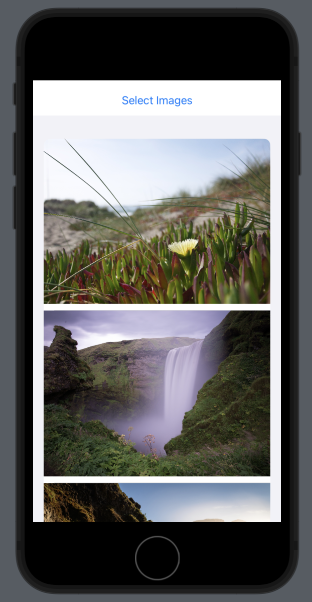

# Network Image

- 네트워크 이미지 불러오기

> ContentView.swift
> 

```swift
import SwiftUI

// https://63d781745dbd723244272cad.mockapi.io/user

struct ContentView: View {
    
    @State private var users = [User]()
    
    var body: some View {
        NavigationView {
            ScrollView{
                LazyVGrid(columns: [GridItem(.flexible())]) {
                    ForEach(users) { user in
                        
                        NavigationLink {
                            UserDetailView(user: user)
                        } label: {
                            HStack{
                                URLImage(urlString: user.avatar)
                                    .frame(width: 100, height: 100)
                                Text("\(user.name)")
                                Spacer()
                            }
                        }
                    }
                }
            }
            .navigationTitle("User List")
        }
        .onAppear{
            WebService().loadUsers { users in
                self.users = users
            }
        }
    }
}

struct ContentView_Previews: PreviewProvider {
    static var previews: some View {
        ContentView()
    }
}
```

> WebService.swift
> 

```swift
import Foundation
import SwiftUI

//Codable: decording을 하기위해 필수로 따라야하는 프로토콜
struct User: Codable, Identifiable {
    var name: String
    var avatar: String
    var createdAt: String
    var id: String
}

//user 불러오기
class WebService{
    func loadUsers(completion: @escaping ([User]) -> Void){
        
        guard let url = URL(string: "https://63d781745dbd723244272cad.mockapi.io/user") else {
            return
        }
        
        URLSession.shared.dataTask(with: url) { (data, response, error) in
            guard let hasData = data else{
                return
            }
            let users = try! JSONDecoder().decode([User].self, from: hasData)
            
            completion(users)
            
        }.resume()
    }
}
//user 이미지 불러오기
class ImageLoader: ObservableObject {
    @Published var image: UIImage? //UI갱신
    
    var urlString: String
    
    //생성될 때 이미지 주소 가져오기
    init(urlString: String) {
        self.urlString = urlString
        self.loadImageFromURL() //함수호출
    }
    
    func loadImageFromURL(){
        
        guard let url = URL(string: urlString) else {
            return
        }
        
        URLSession.shared.dataTask(with: url) { (data, response, error) in
            guard let hasData = data else{
                return
            }
            // UIImage: 데이터 값을 이미지로 변환
            guard let loadedImage = UIImage(data: hasData) else{
                return
            }
            //main thread로 강제
            //UI변경은 main thread에서 해야 함
            DispatchQueue.main.async {
                self.image = loadedImage
            }
        }.resume()
    }
}

//Imageview
struct URLImage: View {
    @ObservedObject var loader: ImageLoader
    
    init(urlString: String) {
        self.loader = ImageLoader(urlString: urlString)
    }
    
    var body: some View {
        Image(uiImage: loader.image ?? UIImage(named: "placeholderImage")!)
            .resizable()
            .aspectRatio(contentMode: .fit)
    }
}
```

> UserDetailView.swift
> 

```swift
import Foundation
import SwiftUI

struct UserDetailView: View {
    
    var user: User
    
    var body: some View {
        VStack {
            URLImage(urlString: user.avatar)
                .frame(width: UIScreen.main.bounds.size.width, height: 250)
            Text(user.name)
                .font(.largeTitle)
            Text(user.createdAt)
            Spacer()
        }
    }
}
```


# Circular Progress

- Slider에 따라 변하는 circular progress 만들기

```swift
import SwiftUI

struct ContentView: View {
    
    @State private var progress: CGFloat = 0
    
    var body: some View {
        VStack{
            //Slider에 따라 progress 값 변경
            Slider(value: $progress)
            
            CircularProgressBar(progress: $progress)
        }
    }
}

struct CircularProgressBar: View {
    @Binding var progress: CGFloat
    
    var body: some View {
        ZStack{
            //background circle
            Circle()
                .stroke(.gray.opacity(0.3), lineWidth: 20)
            
            Circle()
                .trim(from: 0, to: progress) //중요
//                    .stroke(.red, lineWidth: 20)
                .stroke(style: StrokeStyle(lineWidth: 20, lineCap: .round, lineJoin: .round))
                .fill(progress == 1 ? .green : .red)
                .rotationEffect(.degrees(-90))
                .animation(.easeInOut, value: 0)
            
            Text("\(String(format:"%.1f", (progress * 100)))"+"%")
                .foregroundColor(progress == 1 ? .green : .red)
                .font(.largeTitle)
        }
        .padding(30)
    }
}

struct ContentView_Previews: PreviewProvider {
    static var previews: some View {
        ContentView()
    }
}
```


# StopWatch

- 스탑워치 앱 만들기

```swift
import SwiftUI

struct ContentView: View {
    @State private var time: Double = 0
    @State private var dTime: Double = 0
    
    var digitalTime: String{
        let sec = Int(dTime) % 60
        let minute = Int(dTime) / 60
        let milli = dTime.truncatingRemainder(dividingBy: 1) //소숫점만 남기기
        let milliString = String(format: "%.2f", milli).split(separator: ".").last ?? "0"
        
        return "\(String(format: "%02d", minute ))" + ":" + "\(String(format: "%02d", sec ))" + ":" + "\(milliString)"
    }
    
    var timer = Timer.publish(every: 0.1, on: .current, in: .default).autoconnect() //every: 시간(초)
    //autoconnect(): 사용하는 객체가 소멸되면 같이 소멸
    
    @State private var isStart = false
    
    var body: some View {
        VStack{
            ZStack{
                ClockTick()
                ClockNumber()
                
                SecondHand(sec: time)
                MinuteHand(sec: time)
                CenterCircle()
                
                //밀리초
                MilliClockTick()
                    .offset(y: 50)
                MilliSecHand(sec: time)
                    .offset(y: 50)
                CenterCircle()
                    .offset(y: 50)
            }
            .padding(.bottom, 150)
            
            StartStopBtn(isStart: $isStart)
                .padding(.bottom, 10)
            
            Text(digitalTime)
                .font(.largeTitle)
        }
        
        .onReceive(timer) { _ in
            withAnimation {
                if isStart {
                    self.time += 0.1
                }
            }
            if isStart {
                self.dTime += 0.1
            }
        }
    }
}

struct StartStopBtn: View {
    @Binding var isStart: Bool
    
    var body: some View {
        HStack(spacing: 0){
            Button {
                isStart = true
            } label: {
                Text("Start")
                    .frame(width: UIScreen.main.bounds.size.width/2, height: 50)
                    .background(.orange)
            }
            Button {
                isStart = false
            } label: {
                Text("Stop")
                    .frame(width: UIScreen.main.bounds.size.width/2, height: 50)
                    .background(.orange.opacity(0.6))
            }
        }
    }
}

struct CenterCircle: View {
    var body: some View {
        Circle()
            .fill(.blue)
            .frame(width: 10, height: 10)
    }
}

struct ClockTick: View {
    var tickCount = 60
    
    var body: some View {
        ForEach(0..<tickCount, id: \.self){ tick in
            Rectangle()
                .fill(.red)
                .frame(width: 1, height: tick % 5 == 0 ? 20 : 10)
                .offset(y: 100) //기준점 변경 (순서 중요)
                .rotationEffect(.degrees(Double(tick)/Double(tickCount)*Double(360)))
        }
    }
}

struct MilliClockTick: View {
    var tickCount = 10
    
    var body: some View {
        ForEach(0..<tickCount, id: \.self){ tick in
            Rectangle()
                .fill(.red)
                .frame(width: 1, height: 10)
                .offset(y: 30)
                .rotationEffect(.degrees(Double(tick)/Double(tickCount)*Double(360)))
        }
    }
}

struct ClockNumber: View {
    var tickCount = 60
    
    var body: some View {
        ForEach(0..<tickCount, id: \.self){ tick in
            if tick % 5 == 0 {
                Text("\(tick)")
                    .offset(y: -130)
                    .rotationEffect(.degrees(Double(tick)/Double(tickCount)*Double(360)))
            }
        }
    }
}

struct SecondHand: View {
    var sec: Double
    private var height: CGFloat = 70
    
    init(sec: Double) {
        self.sec = sec
    }
    
    var body: some View {
        Rectangle()
            .fill(.orange)
            .frame(width: 3, height: height)
            .offset(y: -height/2)
            .rotationEffect(.degrees(sec/60*360))
    }
}

struct MinuteHand: View {
    var sec: Double
    private var height: CGFloat = 50
    
    init(sec: Double) {
        self.sec = sec
    }
    
    var body: some View {
        Rectangle()
            .fill(.blue)
            .frame(width: 3, height: height)
            .offset(y: -height/2)
            .rotationEffect(.degrees(sec/60/60*360))
    }
}

struct MilliSecHand: View {
    var sec: Double
    private var height: CGFloat = 30
    
    init(sec: Double) {
        self.sec = sec
    }
    
    var body: some View {
        Rectangle()
            .fill(.green)
            .frame(width: 3, height: height)
            .offset(y: -height/2)
            .rotationEffect(.degrees(sec/60*60*360))
    }
}

struct ContentView_Previews: PreviewProvider {
    static var previews: some View {
        ContentView()
    }
}
```


# Photo Picker

- 갤러리에서 이미지를 가져와서 리스트 형태로 표현

```swift
import SwiftUI
import PhotosUI

struct ContentView: View {
    @State var isPresentPicker = false
    @State var images = [UIImage]()
    
    var body: some View {
        VStack {
            Button("Select Images"){
                isPresentPicker = true
            }
            
            List{
                ForEach(images, id:\.self) { image in
                    Image(uiImage: image)
                        .resizable()
                        .aspectRatio(contentMode: .fit)
                        .frame(width: UIScreen.main.bounds.size.width)
                        .listRowInsets(EdgeInsets(top: 0, leading: 0, bottom: 10, trailing: 0))
                }
            }
        }
        .sheet(isPresented: $isPresentPicker) {
            //picker
            ImagePicker(isPresent: $isPresentPicker, images: $images)
        }
    }
}

struct ImagePicker: UIViewControllerRepresentable {
    @Binding var isPresent: Bool
    @Binding var images: [UIImage]
    
    func makeCoordinator() -> Coordinator {
        return ImagePicker.Coordinator(picker: self)
        //ImagePicker structure 자체를 받아옴
    }
    
    func makeUIViewController(context: Context) -> some UIViewController {
        
        var config = PHPickerConfiguration()
        config.selectionLimit = 0 //이미지 여러개 선택
        config.filter = .images
        
        let picker = PHPickerViewController(configuration: config)
        
        picker.delegate = context.coordinator
        
        return picker
    }
    
    class Coordinator: PHPickerViewControllerDelegate {
        
        var picker: ImagePicker
        
        init(picker: ImagePicker){
            self.picker = picker
        }
        
        func picker(_ picker: PHPickerViewController, didFinishPicking results: [PHPickerResult]) {
            self.picker.isPresent = false
            
            for img in results {
                if img.itemProvider.canLoadObject(ofClass: UIImage.self) {
                    
                    img.itemProvider.loadObject(ofClass: UIImage.self) { (loadedImage, error) in
                        
                        guard let hasImage = loadedImage else{
                            print("empty Image")
                            return
                        }
                        self.picker.images.append(hasImage as! UIImage)
                    }
                    
                }else{
                    print("fail to loaded")
                }
            }
        }
        
    }
    
    func updateUIViewController(_ uiViewController: UIViewControllerType, context: Context) {
    }
}

struct ContentView_Previews: PreviewProvider {
    static var previews: some View {
        ContentView()
    }
}
```

