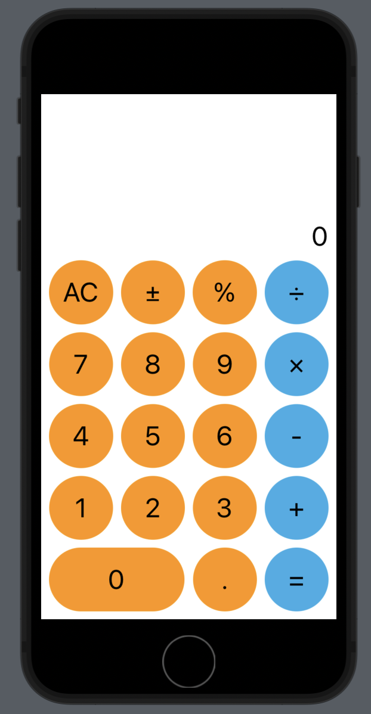
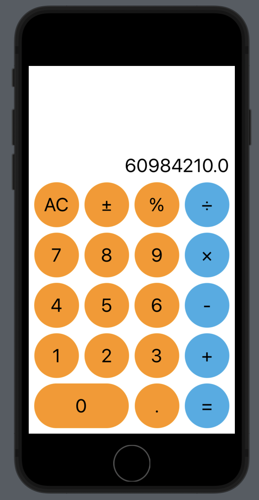

# Calculator
- 계산기 앱 만들기

> ContentView.swift
> 

```swift
import SwiftUI

struct ContentView: View {
    
    var body: some View {
        CalcUI()
    }
}

struct ContentView_Previews: PreviewProvider {
    static var previews: some View {
        ContentView()
    }
}
```

> CalcLogic.swift
> 

```swift
import Foundation

class CalcLogic {
    var digit1: Double? = nil
    var digit2: Double? = nil
    var result: Double? = nil
    var symbol: String? = nil
    
    func logic() -> Double? {
        switch symbol {
        case "+":
            result = digit1! + digit2!
        case "-":
            result = digit1! - digit2!
        case "×":
            result = digit1! * digit2!
        case "÷":
            result = digit1! / digit2!
        case "±":
            result = -digit1!
        case "%":
            result = digit1! * 0.01
        default:
            break
        }
        return result
    }
}
```

> CalcUI.swift
> 

```swift
import Foundation
import SwiftUI

struct CalcButton: View {
    var buttonName = ""
    var color = 0
    
    var body: some View {
        Circle()
            .foregroundColor(color == 3 ? .cyan : .orange)
            .overlay{
                Text(buttonName)
                    .font(.largeTitle)
            }
    }
}

struct CalcUI: View {
    @State private var geoCircleHeight: CGFloat = 50
    @State private var display: String = "0"
    @State private var isTyping: Bool = false
    var core = CalcLogic()
    
    let data = [
        ["AC","±","%","÷"],
        ["7","8","9","×"],
        ["4","5","6","-"],
        ["1","2","3","+"],
        ["0",".","="],
    ]
    var body: some View {
        VStack(spacing: 10){
            Spacer(minLength: 50)
            Text(display)
                .font(.largeTitle)
                .padding(.trailing, 10)
                .frame(width: UIScreen.main.bounds.size.width, alignment: .trailing)
            
            ForEach(0..<4, id: \.self) { i in
                HStack(spacing: 10){
                    ForEach(0..<4, id: \.self){ j in
                        CalcButton(buttonName: data[i][j], color: j)
                            .onTapGesture {
                                calcAction(symbol: data[i][j])
                            }
                    }
                }
                .padding(.horizontal, 10)
            }
            //last line
            HStack(spacing: 10){
                GeometryReader { geometry in
                    
                    Capsule()
                        .foregroundColor(.orange)
                        .aspectRatio(CGSize(width: geometry.size.height * 2 + 10, height: geometry.size.height), contentMode: .fit)
                        .overlay(content: {
                            Text(data[4][0])
                                .font(.largeTitle)
                        })
                        .onAppear{
                            self.geoCircleHeight = geometry.size.height
                        }
                        .onTapGesture {
                            calcAction(symbol: data[4][0])
                        }
                }
                CalcButton(buttonName: data[4][1])
                    .onTapGesture {
                        calcAction(symbol: data[4][1])
                    }
                CalcButton(buttonName: data[4][2], color: 3)
                    .onTapGesture {
                        calcAction(symbol: data[4][2])
                    }
            }
            .aspectRatio(CGSize(width: geoCircleHeight * 4 + 30, height: geoCircleHeight), contentMode: .fit)
            .padding(.horizontal, 10)
        }
        .padding(.bottom, 10)
    }
    func calcAction(symbol: String) {
        
        if Int(symbol) != nil || symbol == "." {
            if isTyping {
                display += symbol
            } else {
                isTyping = true
                display = symbol
            }
            if core.symbol == nil{
                core.digit1 = Double(display)
            } else {
                core.digit2 = Double(display)
            }
            
        } else {
            if symbol != "=" {
                core.symbol = symbol
            }
            isTyping = false
            if symbol == "=" {
                display = "\(String(describing: core.logic()!))"
            } else if symbol == "%" {
                display = "\(String(describing: core.logic()!))"
                core.digit1 = Double(display)
            } else if symbol == "AC" {
                core.digit1 = nil
                core.digit2 = nil
                core.result = nil
                core.result = nil
                core.symbol = nil
                display = "0"
            }
        }
    }
}
```

